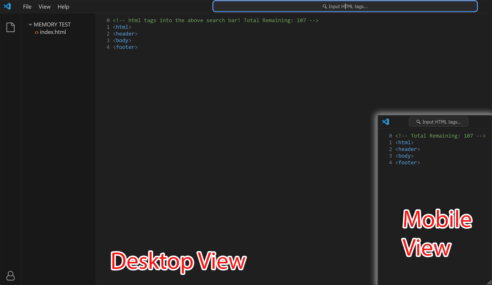

# frontend-memory-game

Live Page: https://spelks.github.io/frontend-memory-game/

## Overview
This project is a memory game developed using HTML, CSS, and JavaScript. It mimics the layout and functionalities of VSCode (in a rudamentory way), providing a way to test and reinforce knowledge of HTML tags.

## Features
- **VSCode-like Interface:** The game interface resembles the layout of VSCode, creating a familiar environment.
- **Memory Challenge:** Test HTML tag knowledge by inputting and guessing tags within the game.
- **Menu Structure:** Includes options to refresh the page, view in full screen, and access a help section to reveal remaining HTML tags.
- **Sidebar Collapse:** Mimicking the behavior of VSCode, the sidebar can be collapsed for a cleaner view.
- **HTML tags:** HTML tag data taken from: https://www.w3schools.com/TAGs/

## How to Play
- **Search input:** Simply input any tags into the search field and hit 'enter'. The text is not case sensitive.

## Screenshots
